# Biomedical Engineering

This repository contains the assignment for the Academic Course "Biomedical Technology" taught in the Spring of 2018-2019 in Aristotle University of Thessaloniki - Electrical & Computer Engineering. The project was written in MATLAB.

The goal of the project is the **spike analysis and recognition from EEG (Electroencephalography) signals**. A method for spike identification was first implemented. Then the extraction of characteristics followed, in order to classify spikes, which represent the activity of a specific neuron.

## Part A

The threshold method is commonly used to detect peaks from extracellular recordings that have undergone 300-3000Hz bandwidth filtering. More specifically, using a width threshold, the signal activity is detected and recorded as a peak, if in a neighborhood it exceeds the value of a threshold 𝛵.

#### question_1_1

Loads the 8 Data_Test_i.mat files in sequence (i = 1,…, 8) and gets the first 10,000 samples for each file. Then their graphs are plotted. We observe that as we move on to the next samples, the noise increases.

    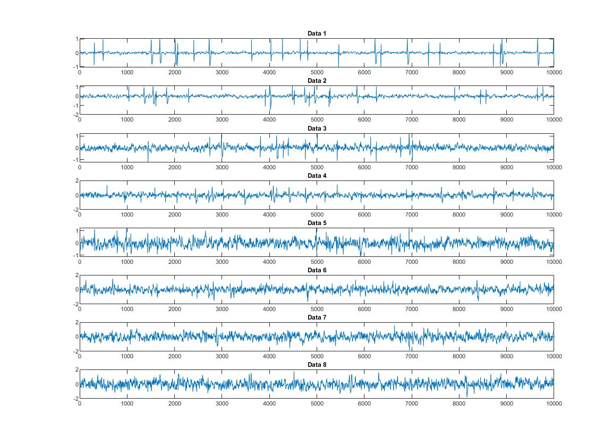

* ##### spikescounter:

The threshold method is commonly used to detect peaks from extracellular recordings that have undergone 300-3000Hz bandwidth filtering. More specifically, using an amplitude threshold, the signal activity is detected and recorded as a spike where in a neighborhood it exceeds the value of a threshold 𝛵. A  formula commonly used to define the threshold value for spike detection is the relation 𝛵 = 𝑘 ∙ 𝜎𝑛 where 𝜎𝑛 is an estimate of the typical noise deviation (information unrelated to spike activity).

We start by setting the value of T to zero and then in each loop we increase it
by 0.02. In each iteration we run the data and find how many times the signal exceeds the threshold. Then by setting the binary variable <u>flag</u> equal to 1 we avoid to measure more than one spike each time the signal exceeds the threshold. When the amplitude of the signal is again lower than the threshold, we set the binary variable equal to 0 again. Finally we find each time the corresponding k from the relation Τ = k * σν and place those k values on a table, which the function finally returns.

---

#### question_1_2 

For each Data_Test_i.mat file (i = 1,…, 8) we call the spikescounter function and get a graph of the first column of the table (spikes) with respect to the second (k). We observe that as we move on to the next samples the angle that is created in the plot tends to smooth, due to the noise that distorts the results.

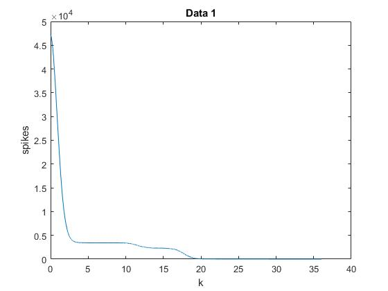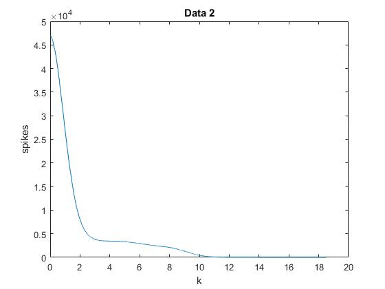 

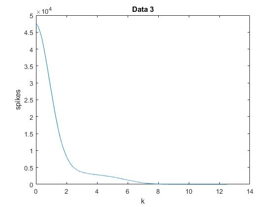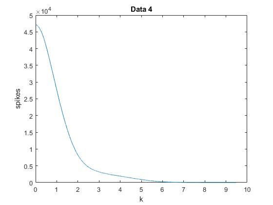

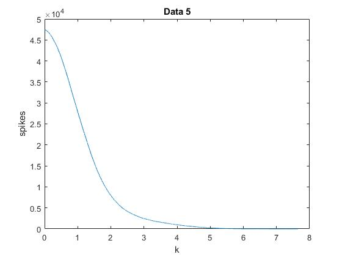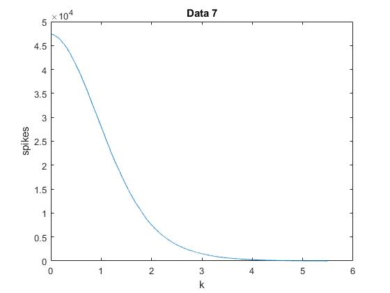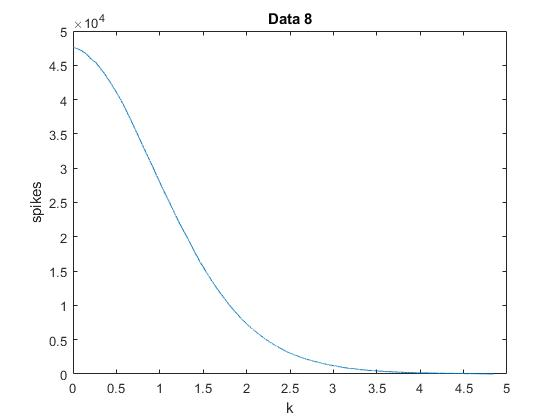

#### Empirical rule

From the above graphs we can conclude that a very good approximation for the actual number of spikes is located at the inflection point of the graphs, knee of the curve, at which the slope begins and normalizes and tends to zero, a fact that appears much clearer in the first samples that have little noise.

## Part B

In this part of the project we will attempt to trace the spikes using the empirical rule and write down the time they occur. The next step is the implementation of a **windowing** method to isolate each spike. In order to study the behavior of each neuron, we had to export 2 features for each windowed spike. Finally, according to these features, spikes will be categorized between 3 neuros.

#### question_2_1 

This script is responsible of loading the 4 Data_Eval_E_i.mat files in sequence (i = 1,…, 4) and calling the function <u>spikescounter</u>, and then plots the graph of spikes with respect to k. According to the above rule a value for k for each file is estimated. After that the threshold T is calculated. Then runs the corresponding data in order to store the estimation time  at which it exceeds the threshold. The time for each peak  is saved in spikeTimesEst. The estimations of k and spikes that were chosen can be seen below.  

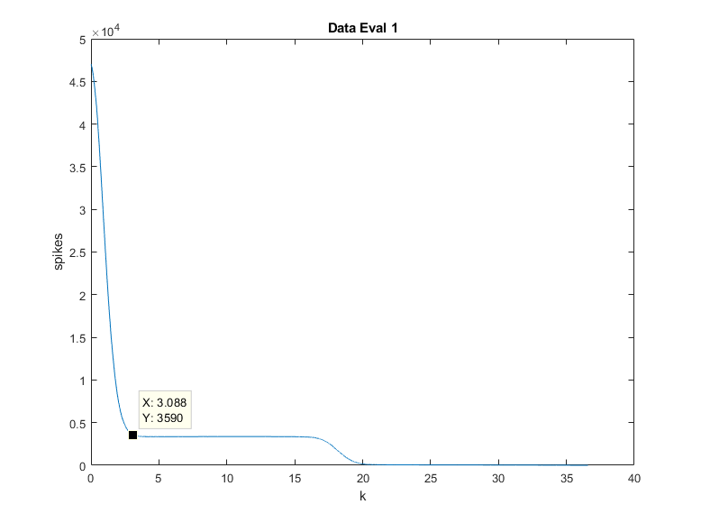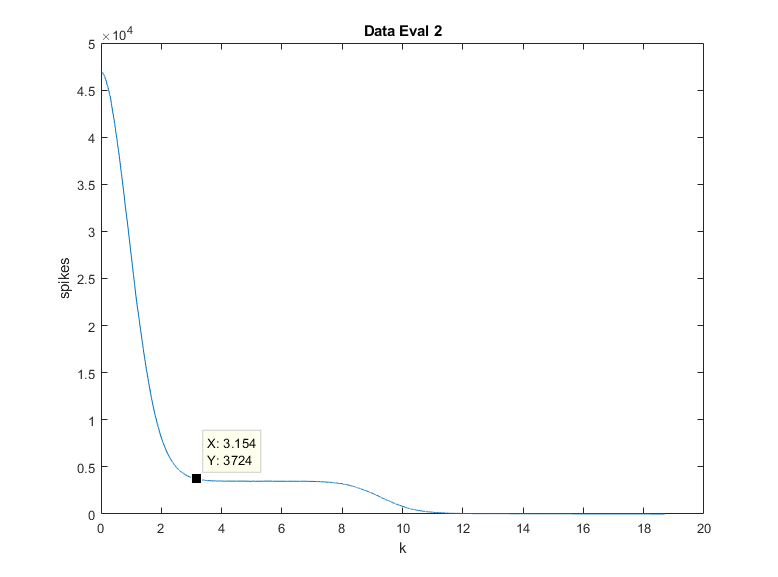

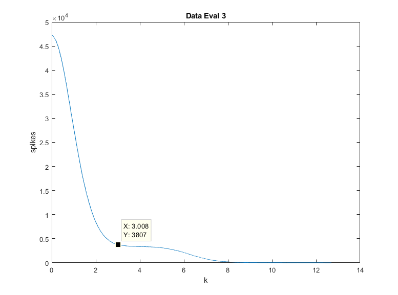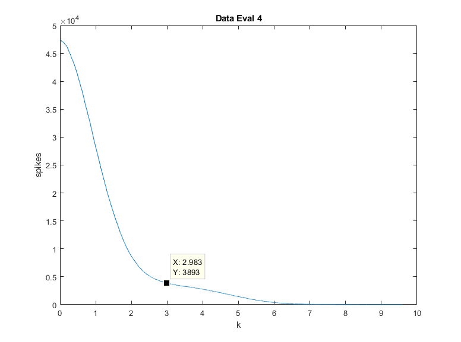

---

#### question_2_2

For each file we save in the corresponding dimension of the <u>firstcut</u> table the values of one spike in a range of 32 points before and after the point that exceeds T (we have already saved its time  in the corresponding <u>spikeTimesEst</u>). Then for each spike that we have saved, we find its maximum and minimum value as well as the times of these values and we store these data in the table <u>max_min_array</u>. The next step is to complete the <u>firstpoint</u>table with the time of the first extrema of each spike window for each file, which is done by comparing the corresponding 2nd and 4th columns of max_min_array. The alignment will eventually be around the first
extrema. Now the aligned spike windows  will be stored in the <u>SpikesEst</u> table.
In order to check that the process is successful we create a table <u>max_min_array_2</u> that stores the maxima, minima and their positions of the new SpikesEst table. Indeed the number 32 (center of the window) will always exist in one of the columns (2nd or 4th) and therefore the alignment based on the first extrema is successful. Then we plot all the aligned spikes in the samegraph.  It is obvious that the firstextrema (minimum or maxima) is always in the middle of the window. And here we also observe  that as we pass on the next sample the noise increases.

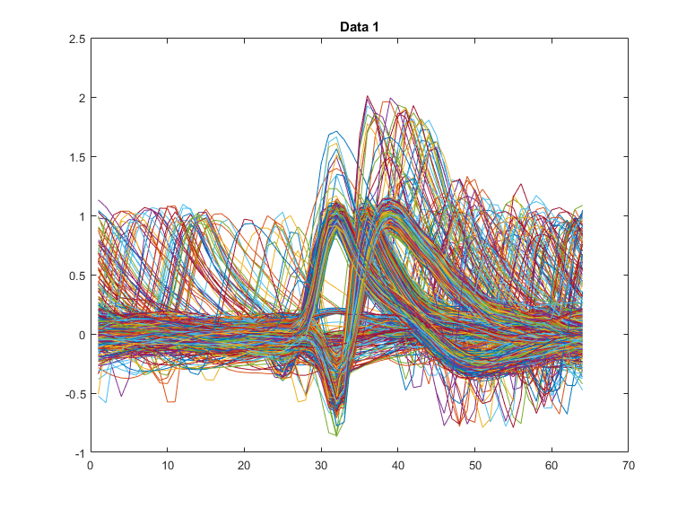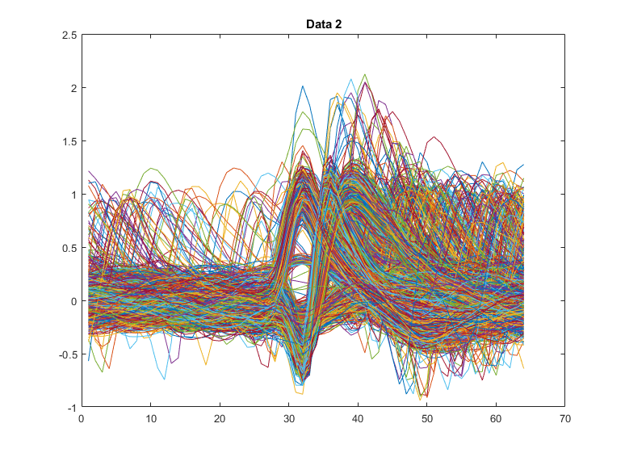

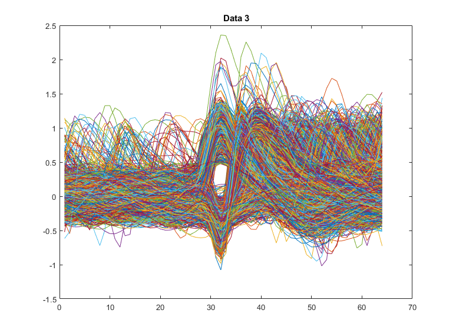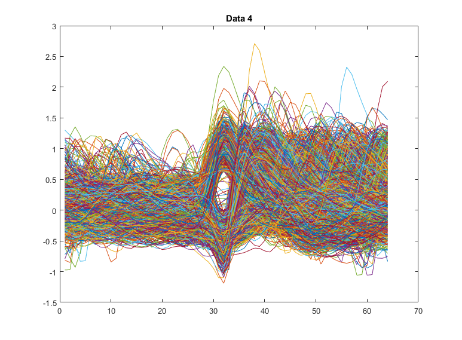

---

#### question_2_3 

We first create a vector <u>check</u> for each file which is initialized with zeros. In addition we define two variables x, y which we increase in a controlled way in a to compare the pairs spikeTimesEst (x) and spikeTimes (y). 

1. We observe that the times we stored in spikeTimesEst (x), i.e. the times when the signal amplitude becomes larger than the threshold, are for each spike greater than the corresponding time of spikeTimes (y). They have a distance of up to 40 samples when it is indeed a spike. So in case these conditions are valid the number 1 is entered in the corresponding check box to show us that the spike that we found corresponds to a real spike. Then both x and y are increased by 1 so that in the next iteration the next pair is considered.
2. On the other hand, if the spikeTimesEst time is greater than the spikeTimes for a distance greater than 40, this means that our code failed to find a real one spike and went straight to the next. This is <u>overlooping</u>. Two very close spikes which are superimposed and behave as 1 spike. They actually
    cross the threshold only once. In this case we should ignore the second spike (y = y + 1).
3. Finally there is the case that the time spikeTimesEst(x) is less than spikeTimes(y). This case occurs when an incorrect spike is detected between two real spikes of spikeTimes. This means that our code found one spike due to noise and not a neuron and occurs due to approximate value of k and therefore of threshold T.  So in this case there is a wrongly estimated spike. Therefore we should not change the value of zero in check table. Only x is increased (x = x + 1) in order to proceed to the next spike we spotted.

Simultaneously with finding the correct spikes, we create for each file a <u>spikeClassEst</u> table which is initialized with spikeClass and sets as 0 the values for which the corresponding spikes cannot be detected by our code (case 2) as they are close to others and create superposition. Here we also set a counter that shows us the number of spikes in we finally managed to identify.

---

#### question_2_4 

In this question we should calculate two features and display as points in two-dimensional space the pairs of features calculated for each waveform using a different color for each neuron. The characteristics calculated for each waveform are its maximum amplitude of Fourier Transform and the maximum amplitude in time. These calculations will only be done for the correctly identified spikes using the check vector. In photos below  the two-dimensional space represents with blue the 1st neuron, with red the 2nd and with yellow the 3rd one.

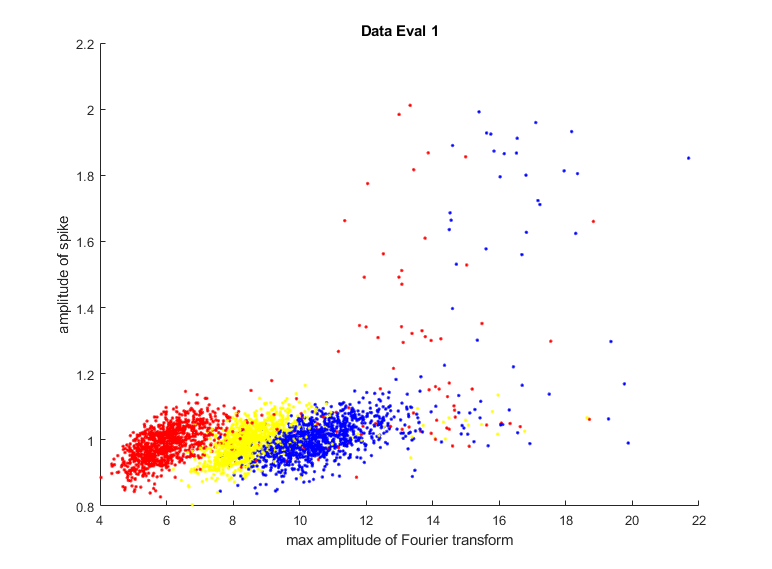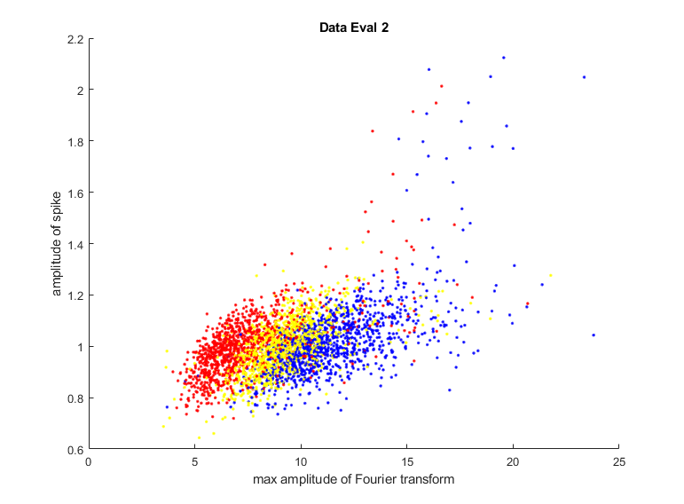

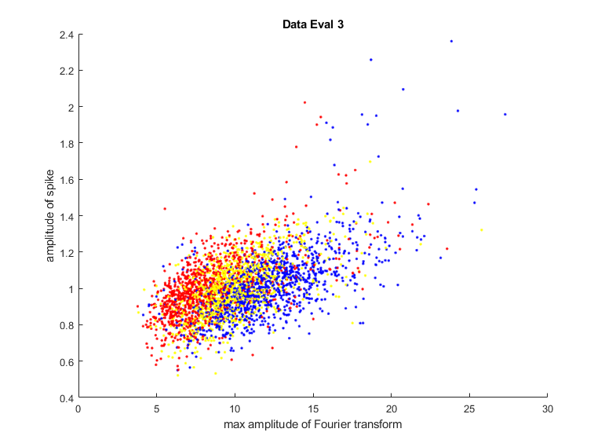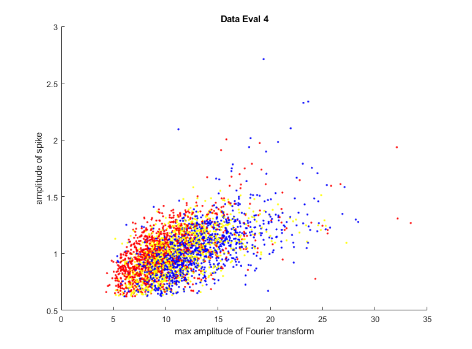

---

#### question_2_5

In the Data table and in the vector group we will set values only for the real spikes that we managed to identify, so in this case we need two variables **I** and  **j**.

I refers to the identified spikes while j refers to the total spikes we identified. For this reason j increases at the beginning of each iteration until check (j, k) has a non-zero value. In the first column of Data we enter the time of the maximum of the I peak, in the second the time of minimum, in the third the minimum value and the fourth the number of steps required from the point where threshold is crossed until maximum.

It has previously been observed that the peaks of neuron 1 start with a minimum which is relatively small (usually around -0.3) but also as smoother as required  (about 4 steps to reach the signal from the point that passes the threshold at its top).

The peaks of neuron 2 also start with a minimum but this is deeper (usually - 0.55) and are also steeper, ie the signal reaches the point where the threshold at the top in 1 or 2 steps. 

Finally, the peaks of neuron 3 start with a maximum.

In each file k = 1,…, 4 we call the **MyClassify function** with arguments Data (:,:, k) and group(:, k), which returns the percentages of correct classification based on the features that we have defined. For the peak and k values given in query 2.1 the function returned the following classification rates for the 4 files: 

|                    | **Data_Eval_1** | **Data_Eval_2** | **Data_Eval_3** | **Data_Eval_4** |
| :----------------: | :-------------: | :-------------: | :-------------: | :-------------: |
| **Accuracies** (%) |     98.9167     |     96.6667     |     95.9167     |     92.7500     |

It is obvious that the noise affects the correct classification, because the features are less distinct.

---

#### question_2_5_reloaded

In this process we add to columns 5 and 6 of the Data table its maximum width of Fourier transform of each waveform and its maximum amplitude in time, as were calculated in question 2.4. By observation we conclude that for width in time up to 1, if the width of the Fourier is less than 7.1 then approximately the waveform is occurred due to the 2nd neuron, when it is between 7.1 and 8.7 due to the 3rd neuron and when it is greater than 8.7 due to the 1st neuron. 

Respectively for width in time greater than 1 approximate boundaries change as follows: If the maximum amplitude in the frequency is less than 7.8 the waveform occurs due to the 2nd neuron, if it is between 7.8 and 9.8 due to the 3rd neuron and if it is greater than 9.8 due to the 1st neuron. 

Because in this case the features are plenty, we examine for each waveform whose neurons are the most features and we assign this spike to the corresponding neuron. In this case the called function returns for the 4 datasets the following values: 

|                    | **Data_Eval_1** | **Data_Eval_2** | **Data_Eval_3** | **Data_Eval_4** |
| :----------------: | :-------------: | :-------------: | :-------------: | :-------------: |
| **Accuracies** (%) |     93.0000     |     84.0000     |     80.0833     |     75.8333     |

It is also here obvious that the noise affects the correct classification, because the features are less distinct.

## Classifier

The Machine Learning classifier is implemented inside **MyClassify.m** script. This process consists of separating respectively the training and evaluation data and implementing a **trained deep learning neural network** via the built-in MATLAB function *clasify*. Finally, the script calculates the Accuracy.

## Conclusion

Obviously more features do not mean better Accuracy. It is observable that by adding more features to the input vector (maximum width of Fourier transform of each waveform & its maximum amplitude in time) the Accuracies where significantly decreased. The reason for this to happen is that those features are not strong enough and "mislead" our classifier. It is preferable to use less but "stronger" features that makes the input data more "distinct".

## Execution

When running “MasterCode” a choice menu is displayed to the user. Instructions about the plots and the results of the code are also displayed. To implement **Part A** user has to press *1*, while to implement **Part B** has to press *2*. By pressing *0* the program is terminated.

